# Whisky-app noter med screenshots og struktur

## Screenshots

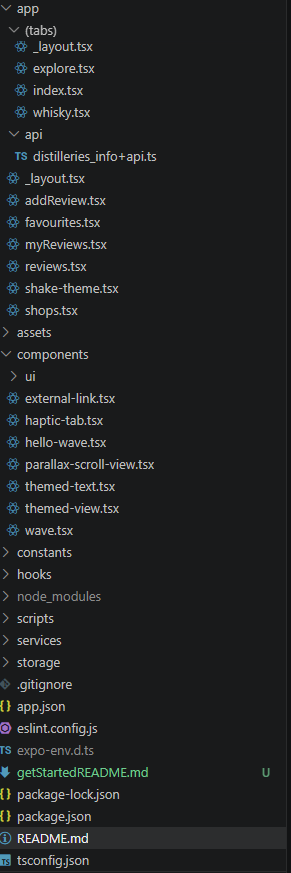

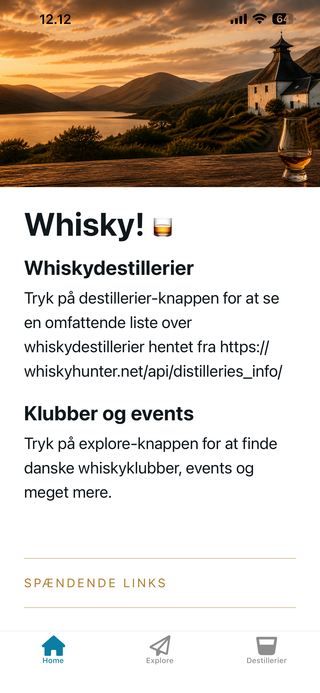

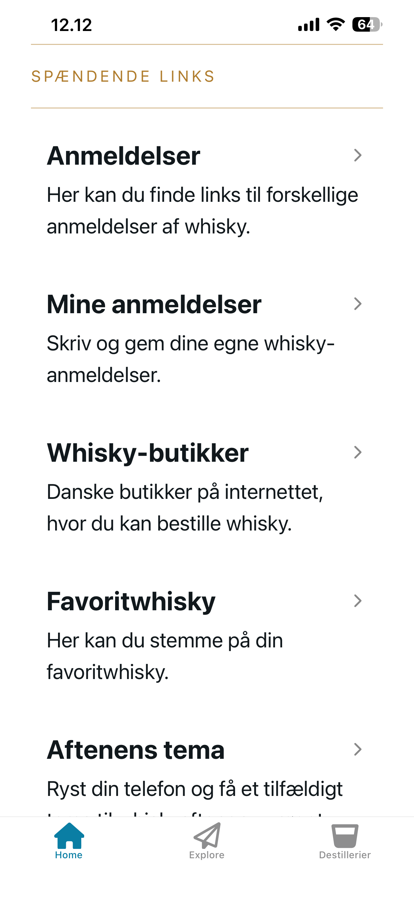

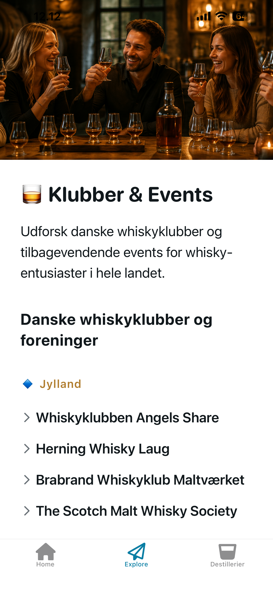

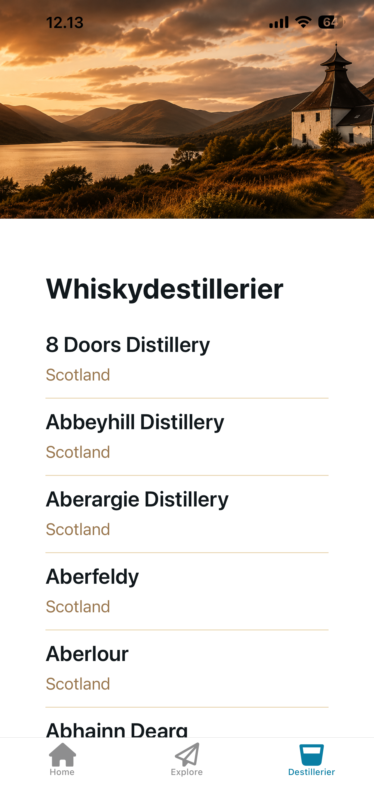

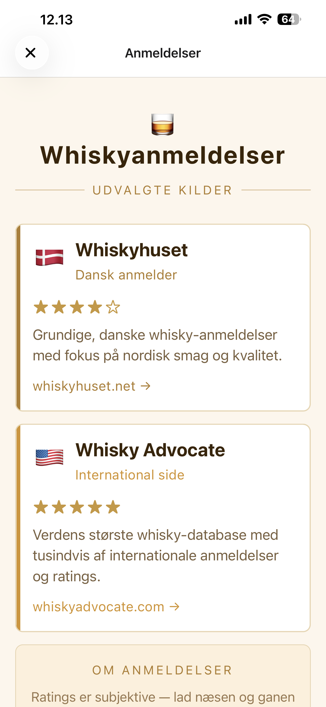

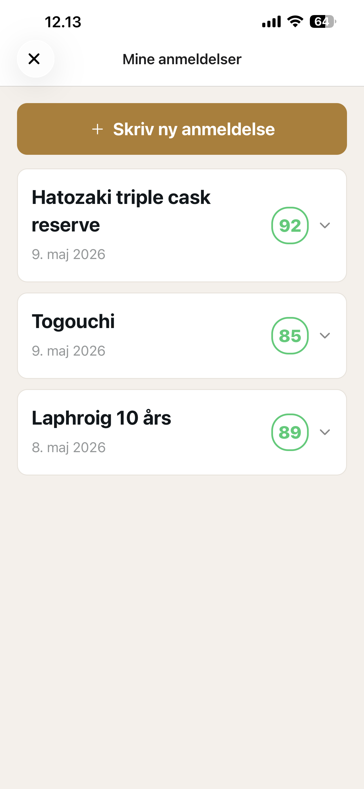

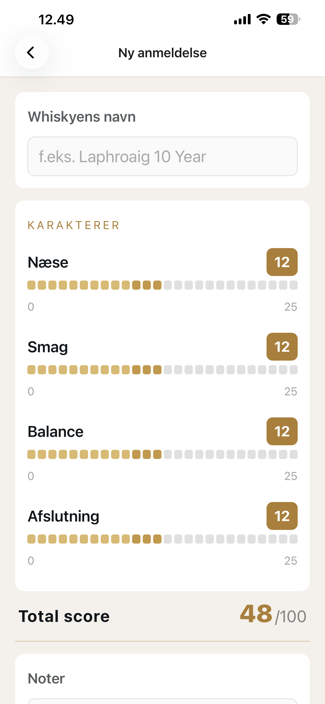

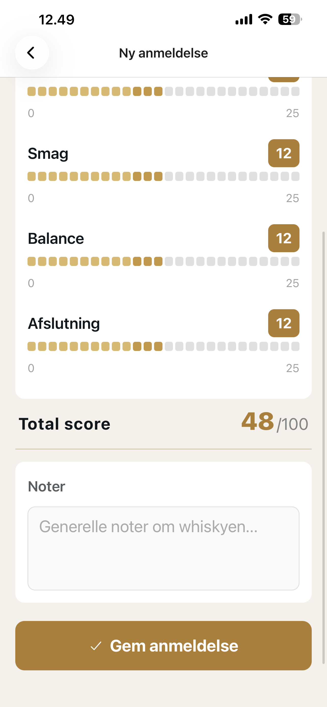

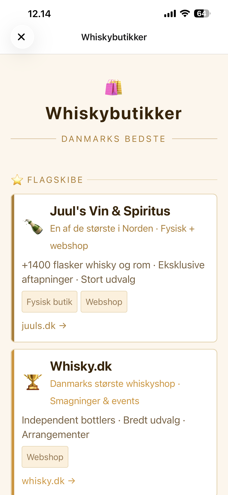

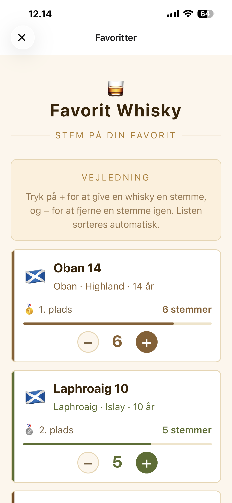

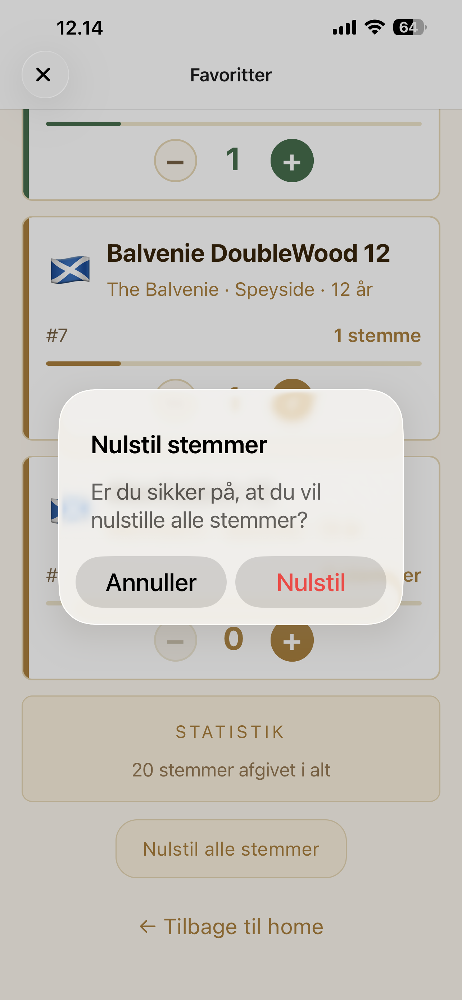

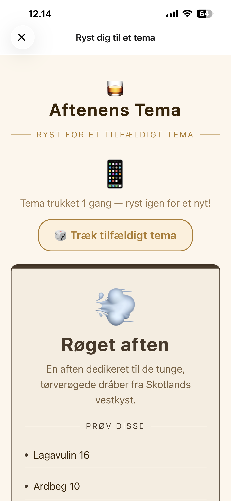

## Struktur

### Tabs

- \_layout.tsx: Tab-navigation med tre skærme: Home, explore og destillerier.
- explore.tsx: explore-skærmen med info om klubber & events.
- whisky.tsx: Visning af destillerier i Japan og Skotland via externt api-kald.
- index.tsx: Hoved-skærm med info om tabs-navigationen og links til: Whisky-anmeldelser, egne anmeldelser, whisky-butikker, valg af favorit-whisky og ryst dig til et tema - links åbner modaler.

### Modaler

- \_layout.tsx: layout med stack-screen
- addReview.tsx: Skriv ny anmeldelse og gem på mobilen/tablet
- favourites: Stem på din favoritwhisky og se scoreboard
- modal.tsx: ikke brugt
- myReviews.tsx: Visning af mine anmeldelser.
- reviews.tsx: anmeldelser på nettet
- shake-theme.tsx: ryst mobilen og få et tilfældigt tema
- shops.tsx: links til butikker, hvor du kan købe whisky

### Api route

- distilleries_info+api.ts
